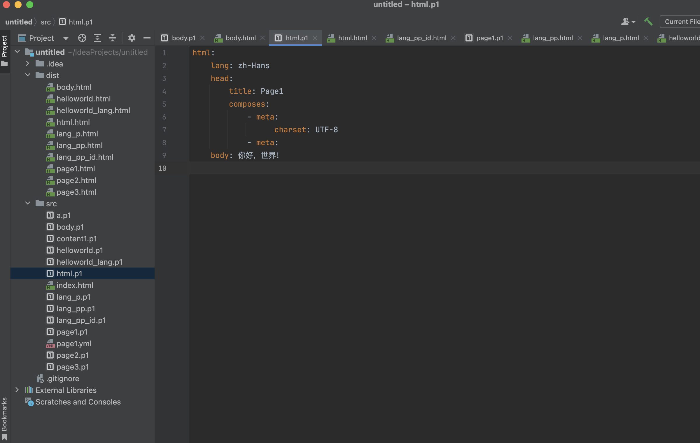
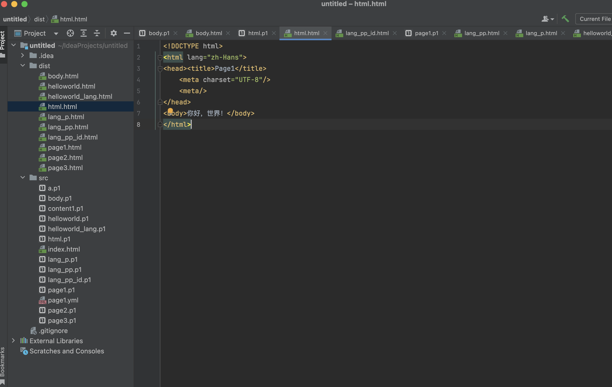
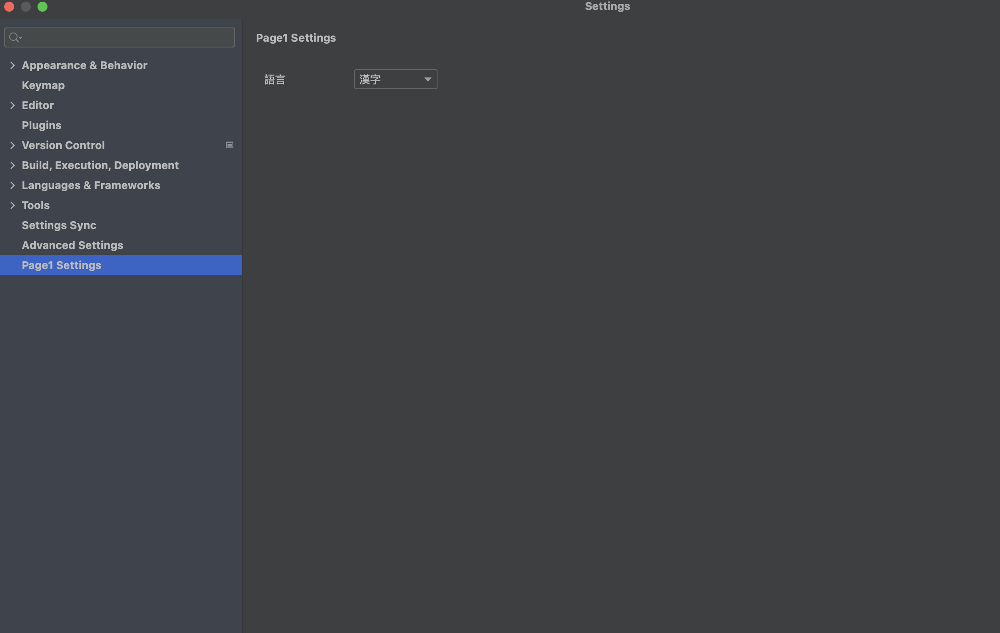
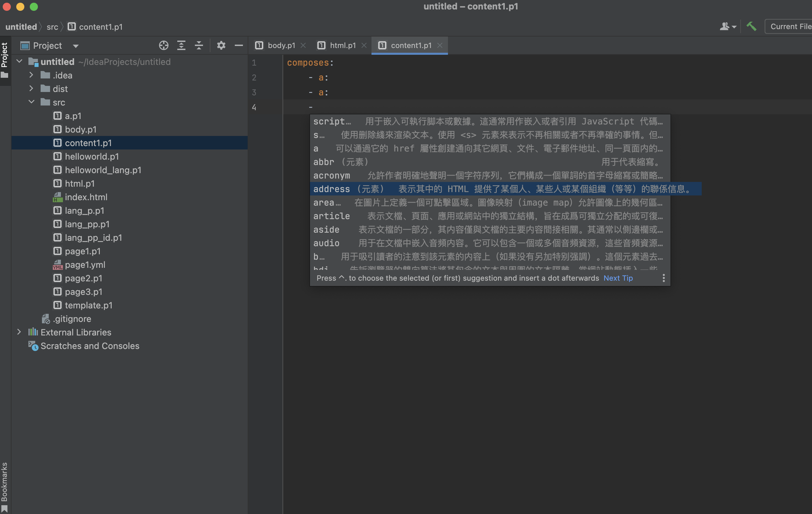

# Page1

Page1 is an HTML generation tool that uses YAML-like files to describe HTML structure, allowing easy conversion to HTML
files.

[中文](./README_CN.md)

## Why Page1?

* **Concise Syntax**: YAML is more readable and straightforward compared to XML.
* **Custom Defaults**: Supports default syntax rules for common elements.
* **Localized Tags**: Allows using native languages (e.g., Chinese characters) for tag descriptions.
* **CSS/JS Optimizations**: Streamlined operations for CSS and JavaScript integration.






## Getting Started

* **Create a File**: Create a file with the `.p1` extension.
* **Generate HTML**: Right-click the file or use the editor option *"Generate HTML from Page1"*.
* **Preview**: Open the file in a browser via *Open in -> Open in Browser*.

### Basics

#### Simple Example

```yaml
html:
  body: hello, world!
```

Generates:

```html
<!DOCTYPE html>
<html>
<body>hello, world!</body>
</html>
```

#### Attributes

Add the `lang` attribute to the html tag:

```yaml
html:
  lang: en-US
  body: hello, world!
```

Generates:

```html
<!DOCTYPE html>
<html lang="en-US">
<body>hello, world!</body>
</html>
```

#### Child Elements

Add nested elements using YAML indentation:

```yaml
html:
  lang: en-US
  body:
    p: hello, world!
```

Generates:

```html
<!DOCTYPE html>
<html lang="en-US">
<body><p>hello, world!</p></body>
</html>
```

### Advanced

#### Multiple Child Elements

Use the `composes` property to define multiple child elements:

```yaml
html:
  lang: en-US
  body:
    composes:
      - p: hello,
      - p: world!
```

Note: The - symbol denotes a list in YAML.

#### id/class/style

Define element attributes like `id`, `class`, or `style`:

```yaml
html:
  lang: en-US
  body:
    id: a
    class: b c
    style:
      width: 100%
      height: 100%
    composes:
      - p: hello,
      - p: world!
```

Alternative syntax for `class` and `composes`:

```yaml
html:
  lang: en-US
  body:
    id: a
    class:
      - b
      - c
    style:
      width: 100%
      height: 100%
    composes: hello, world!
```

#### When to Use `composes`

Use `composes` when child elements have different tag names. We recommend placing all child elements under `composes`
for clarity.

#### Allows omitting `html` and `body`.

or:

```yaml
body:
  style:
    width: 100%
    height: 100%
  composes: hello, world!
```

or:

```yaml
style:
  width: 100%
  height: 100%
composes: hello, world!
```

or:

```yaml
p: hello, world!
```

or:

```yaml
- p: hello,
- p: world!
```

## TODO

Page1 is under active development. Upcoming features include:

* Auto-convert copied HTML to YAML
* `include` directives
* Conditional logic (`if`/`else`, `switch`/`when`)
* Loops (`for`, `while`)
* Executable scripts
* Enhanced syntax highlighting and code completion

## Support


