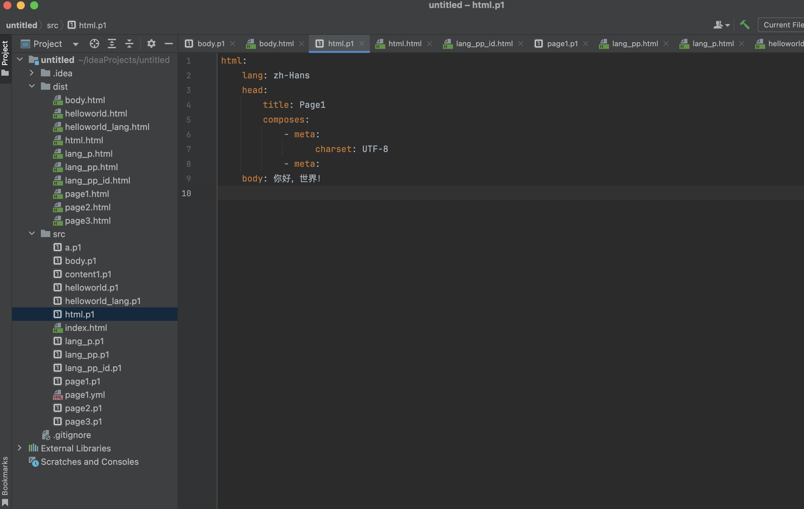
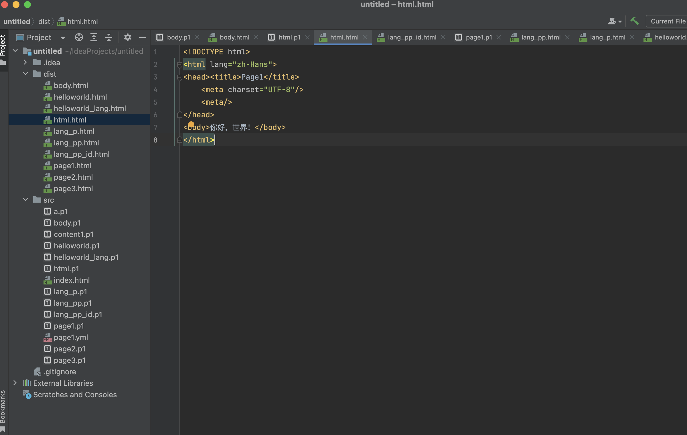

# Page1

Page1是一個HTML生成工具，使用類似YAML的文件來描述HTML，可以方便地將其轉换爲HTML文件。

## 為什麼做這個？

* 更簡潔的文件。個人感覺YAML相比XML更加清晰易讀。
* 可以加入一些默認語法。
* 標籤本地化。比如用漢字來描述。
* 針對CSS、JS的操作優化。





## 開始

* 創建文件：創建一個以`.p1`為後綴的文件
* 生成HTML：右鍵文件或編輯區“Generate HTML from Page1”
* 預覽Page1文件：Open in -> Open in Browser -> 選擇瀏覽器

### 基礎

#### 簡單的示例

我們來一個簡單的示例：

```yaml
html:
  body: hello, world!
```

將會生成HTML：

```html
<!DOCTYPE html>
<html>
<body>hello, world!</body>
</html>
```

#### 屬性

我們發現html沒有語言屬性，在Page1裡可以這麼寫：

```yaml
html:
  lang: en-US
  body: hello, world!
```

將會生成HTML：

```html
<!DOCTYPE html>
<html lang="en-US">
<body>hello, world!</body>
</html>
```

#### 子元素

子元素的添加也很簡單。現在，你已經學會了Page1。後面的學習中，將不再展示生成的HTML。

```yaml
html:
  lang: en-US
  body:
    p: hello, world!
```

將會生成HTML：

```html
<!DOCTYPE html>
<html lang="en-US">
<body><p>hello, world!</p></body>
</html>
```

### 進階

#### 多個子元素

為了支持多個子元素，我們引入了“composes”屬性，不用擔心，截止目前，僅加入了這一個HTML標準以外的屬性。

```yaml
html:
  lang: en-US
  body:
    composes:
      - p: hello,
      - p: world!
```

注意，`p`前面的`-`，這是YAML的列表寫法

#### id/class/style

```yaml
html:
  lang: en-US
  body:
    id: a
    class: b c
    style:
      width: 100%
      height: 100%
    composes:
      - p: hello,
      - p: world!
```

class和composes也可以這麼寫：

```yaml
html:
  lang: en-US
  body:
    id: a
    class:
      - b
      - c
    style:
      width: 100%
      height: 100%
    composes: hello, world!
```

#### 什麼時候用composes

如果子元素是多個且tagName不同的時候，就需要使用composes了。

建議子元素放在composes下。

### 更多

### 允許省略`html`,`body`

如：

```yaml
body:
  style:
    width: 100%
    height: 100%
  composes: hello, world!
```

或

```yaml
style:
  width: 100%
  height: 100%
composes: hello, world!
```

或

```yaml
p: hello, world!
```

或

```yaml
- p: hello,
- p: world!
```

Page1是有更多目標的，還有很多功能在開發中，敬請期待。

## TODO

* html複製粘貼自動轉化爲yaml
* include
* if/else
* switch/when
* for/while/loop
* 可執行腳本
* 高亮、代碼補全優化

## 讚賞


